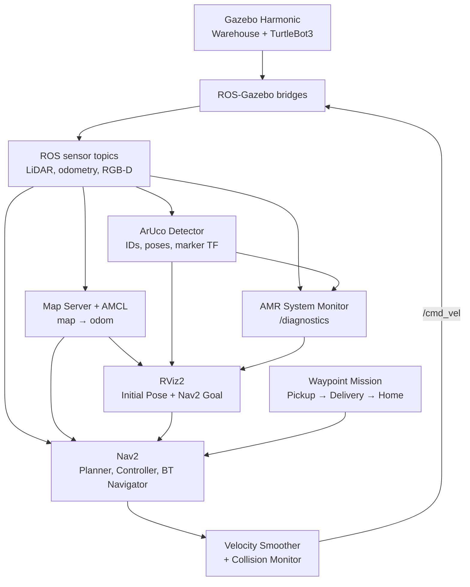

# AMR Navigation, Vision & Diagnostics

A simulation-based Autonomous Mobile Robot (AMR) project built with ROS 2 Jazzy, Gazebo Harmonic, Navigation2, OpenCV, and RViz2. It combines autonomous navigation, RGB-D perception, ArUco marker pose estimation, and live system health diagnostics in a custom warehouse environment.

> This repository targets simulation on Ubuntu 24.04. Physical robot deployment and visual odometry are not currently implemented.

## Features

- Custom Gazebo warehouse and TurtleBot3 Waffle RGB-D model
- Saved-map localization with AMCL and autonomous navigation with Nav2
- SLAM mode for mapping and exploration
- Simulated LiDAR, wheel odometry, IMU, RGB camera, and depth camera
- ArUco `DICT_4X4_50` detection and 3D pose estimation
- ArUco marker IDs, poses, debug images, and marker TF frames
- Health monitoring for LiDAR, odometry, velocity commands, RGB camera, and ArUco detection
- Predefined three-stop waypoint mission: Pickup, Delivery, and Home
- Interactive automated runtime verification
- ROS 2 simulation time and Gazebo-to-ROS sensor bridges
- Clean-clone dependency, build, and test validation

## Demo Video

The demonstration video shows the interactive automated test checking ROS 2 discovery, AMCL localization, TF connectivity, Nav2 lifecycle states, sensor streams, frame IDs, navigation commands, ArUco detection, pose estimation, marker TF, and AMR health diagnostics.

[](https://youtu.be/RUlGBJWJuIA)

[Watch the AMR Navigation, ArUco Vision & Diagnostics demo on YouTube](https://youtu.be/RUlGBJWJuIA)

## Architecture



The main TF chain is:

```text
map
└── odom
    └── base_footprint
        └── base_link
            ├── base_scan
            ├── camera_rgb_optical_frame
            │   └── aruco_marker_<id>
            └── camera_depth_frame
```

## Repository Structure

```text
amr-navigation-vision-diagnostics/
├── LICENSE
├── README.md
├── docs/
│   ├── Nav2_Gazebo_Troubleshooting_TH.md
│   └── TEST_RESULTS.md
├── scripts/
│   └── demo_test.sh
└── src/
    ├── amr_bringup/
    │   ├── launch/
    │   ├── config/
    │   └── package.xml
    ├── amr_diagnostics/
    │   ├── amr_diagnostics/
    │   ├── package.xml
    │   └── setup.py
    ├── amr_navigation/
    │   ├── amr_navigation/
    │   ├── package.xml
    │   └── setup.py
    ├── amr_simulation/
    │   ├── maps/
    │   ├── models/
    │   ├── worlds/
    │   ├── CMakeLists.txt
    │   └── package.xml
    └── amr_vision/
        ├── amr_vision/
        ├── package.xml
        └── setup.py
```

## Requirements

- Ubuntu 24.04 LTS
- ROS 2 Jazzy
- Gazebo Harmonic
- Navigation2
- RViz2
- OpenCV with ArUco support
- Python 3
- Git
- rosdep
- colcon
- A graphical environment capable of running Gazebo and RViz2

The commands below assume ROS 2 Jazzy is already installed. See the [official ROS 2 Jazzy installation guide](https://docs.ros.org/en/jazzy/Installation.html) if needed.

## Installation

### 1. Install required packages

```bash
sudo apt update

sudo apt install -y \
  git \
  python3-colcon-common-extensions \
  python3-rosdep \
  ros-jazzy-navigation2 \
  ros-jazzy-nav2-bringup \
  ros-jazzy-nav2-minimal-tb3-sim \
  ros-jazzy-slam-toolbox \
  ros-jazzy-ros-gz \
  ros-jazzy-ros-gz-image \
  ros-jazzy-cv-bridge \
  ros-jazzy-tf2-ros \
  ros-jazzy-rqt-image-view \
  ros-jazzy-teleop-twist-keyboard \
  python3-opencv \
  python3-numpy
```

### 2. Initialize rosdep

Run this command once per machine:

```bash
sudo rosdep init
```

If rosdep has already been initialized, skip the command above.

Update the rosdep database:

```bash
rosdep update
```

A `pkg_resources is deprecated` warning may appear on Ubuntu 24.04. It does not prevent rosdep from resolving dependencies.

### 3. Clone the repository

```bash
cd ~

git clone \
  https://github.com/nattannsra18/amr-navigation-vision-diagnostics.git

cd amr-navigation-vision-diagnostics
```

### 4. Install ROS package dependencies

```bash
source /opt/ros/jazzy/setup.bash

rosdep install \
  --from-paths src \
  --ignore-src \
  --rosdistro jazzy \
  -r -y
```

A successful dependency installation should report:

```text
#All required rosdeps installed successfully
```

## Build

From the repository root:

```bash
cd ~/amr-navigation-vision-diagnostics

source /opt/ros/jazzy/setup.bash

colcon build --symlink-install
```

Source the workspace after building:

```bash
source install/setup.bash
```

A successful build should report:

```text
Summary: 5 packages finished
```

Source both setup files in every new terminal:

```bash
source /opt/ros/jazzy/setup.bash
source ~/amr-navigation-vision-diagnostics/install/setup.bash
```

They can optionally be added to `~/.bashrc`:

```bash
echo 'source /opt/ros/jazzy/setup.bash' >> ~/.bashrc
echo 'source ~/amr-navigation-vision-diagnostics/install/setup.bash' >> ~/.bashrc
```

After modifying source files, rebuild and source the workspace again:

```bash
cd ~/amr-navigation-vision-diagnostics

source /opt/ros/jazzy/setup.bash
colcon build --symlink-install
source install/setup.bash
```

## Run

### Authenticated web bridge and software Emergency Stop

Set the same random robot credential configured in FastAPI without placing it
on a command line or URL:

```bash
export ROBOT_WS_TOKEN='<same-random-token-as-backend>'
ros2 run amr_web_bridge web_bridge_node --ros-args \
  -p server_url:=ws://localhost:8000 \
  -p robot_id:=robot01 \
  -p emergency_stop_cmd_vel_topic:=/cmd_vel \
  -p emergency_stop_zero_rate:=10.0
```

The bridge sends the credential as an Authorization bearer header and does not
log it. `/cmd_vel` is the final simulation command topic (the velocity smoother
outputs there and the Gazebo drive plugin consumes it). While latched, the
bridge cancels Nav2 asynchronously, drops queued navigation, rejects new goals,
and publishes zero `Twist` at 10 Hz. Reset never replays the interrupted goal.

> THIS SOFTWARE EMERGENCY STOP IS NOT A SUBSTITUTE FOR A CERTIFIED PHYSICAL
> EMERGENCY STOP CIRCUIT.

### Saved-map navigation, vision, and diagnostics

This is the main end-to-end launch:

```bash
cd ~/amr-navigation-vision-diagnostics

source /opt/ros/jazzy/setup.bash
source install/setup.bash

ros2 launch amr_bringup navigation.launch.py
```

The launch starts the warehouse simulation, robot model, sensor bridges, saved map, AMCL, Nav2, RViz2, ArUco detector, and AMR diagnostic monitor.

### Initialize localization in RViz2

After Gazebo and RViz2 open:

1. Click **2D Pose Estimate**.
2. Click the robot's approximate position on the map.
3. Drag the arrow in the robot's forward direction.
4. Release the mouse button.
5. Wait for the AMCL particle cloud to converge.
6. Confirm that **Localization** and **Navigation** are active.
7. If Navigation remains inactive, click **Startup** in the Navigation 2 panel.

### Send a navigation goal

1. Click **Nav2 Goal** in RViz2.
2. Select a free position on the map.
3. Drag the arrow to set the desired final heading.
4. Release the mouse button.
5. Confirm that a global path appears and the robot begins moving.

### Run the waypoint mission

The included mission sends the robot through:

```text
Pickup → Delivery → Home
```

Run it from another terminal after setting the initial pose and activating Nav2:

```bash
source /opt/ros/jazzy/setup.bash
source ~/amr-navigation-vision-diagnostics/install/setup.bash

ros2 run amr_navigation waypoint_mission
```

The waypoint coordinates are configured for the included `warehouse_map`.

## SLAM Mode

Use SLAM mode when creating or updating the occupancy map:

```bash
cd ~/amr-navigation-vision-diagnostics

source /opt/ros/jazzy/setup.bash
source install/setup.bash

ros2 launch amr_bringup simulation.launch.py
```

Drive the robot from another sourced terminal:

```bash
source /opt/ros/jazzy/setup.bash
source ~/amr-navigation-vision-diagnostics/install/setup.bash

ros2 run teleop_twist_keyboard teleop_twist_keyboard
```

Save the completed map from the repository root:

```bash
cd ~/amr-navigation-vision-diagnostics

ros2 run nav2_map_server map_saver_cli \
  -f src/amr_simulation/maps/warehouse_map
```

## ROS Nodes

Node availability depends on the selected launch mode. Not every listed node runs at the same time.

| Node | Package or component | Responsibility |
|---|---|---|
| `/ros_gz_bridge` | `ros_gz_bridge` | Bridges Gazebo clock, LiDAR, odometry, commands, TF, and simulation interfaces |
| `/camera_image_bridge` | `ros_gz_image` | Bridges RGB and depth images from Gazebo |
| `/camera_info_bridge` | `ros_gz_bridge` | Bridges RGB camera calibration information |
| `/robot_state_publisher` | `robot_state_publisher` | Publishes fixed robot link transforms |
| `/map_server` | Nav2 | Publishes the saved occupancy map |
| `/amcl` | Nav2 | Localizes the robot and publishes `map → odom` |
| `/lifecycle_manager_localization` | Nav2 | Configures and activates localization nodes |
| `/lifecycle_manager_navigation` | Nav2 | Configures and activates navigation nodes |
| `/planner_server` | Nav2 | Computes global paths |
| `/controller_server` | Nav2 | Computes local motion commands |
| `/bt_navigator` | Nav2 | Executes navigation behavior trees |
| `/behavior_server` | Nav2 | Provides recovery and auxiliary behaviors |
| `/smoother_server` | Nav2 | Smooths planned paths |
| `/waypoint_follower` | Nav2 | Executes multi-waypoint tasks |
| `/velocity_smoother` | Nav2 | Limits and smooths velocity commands |
| `/collision_monitor` | Nav2 | Provides an additional command-level safety layer |
| `/route_server` | Nav2 | Provides route-planning services when configured |
| `/aruco_detector` | `amr_vision` | Detects markers and publishes IDs, poses, marker TF, and debug images |
| `/amr_system_monitor` | `amr_diagnostics` | Publishes AMR health information on `/diagnostics` |
| `/slam_toolbox` | SLAM Toolbox | Builds and updates the occupancy map in SLAM mode |
| `/basic_navigator` | `amr_navigation` | Sends the Pickup → Delivery → Home waypoint mission |

## ROS Topics and Actions

Rates are representative values observed in the current simulation configuration.

| Name | Type | Typical rate | Producer | Purpose or consumers |
|---|---|---:|---|---|
| `/clock` | `rosgraph_msgs/msg/Clock` | ~1000 Hz | Gazebo bridge | Simulation time |
| `/scan` | `sensor_msgs/msg/LaserScan` | 5 Hz | Gazebo bridge | AMCL, costmaps, collision monitor, and diagnostics |
| `/odom` | `nav_msgs/msg/Odometry` | ~29 Hz | Gazebo bridge | Nav2, TF, and diagnostics |
| `/imu` | `sensor_msgs/msg/Imu` | 200 Hz configured | Gazebo bridge | Simulated inertial measurements |
| `/cmd_vel` | `geometry_msgs/msg/Twist` | ~20 Hz while active | Nav2 velocity pipeline | Robot motion commands and diagnostics |
| `/camera/color/image_raw` | `sensor_msgs/msg/Image` | ~15 Hz | Image bridge | ArUco detector and camera diagnostics |
| `/camera/color/camera_info` | `sensor_msgs/msg/CameraInfo` | Sensor rate | Camera-info bridge | Camera intrinsics for marker pose estimation |
| `/camera/depth/image_raw` | `sensor_msgs/msg/Image` | 5 Hz | Image bridge | Depth visualization and future perception |
| `/map` | `nav_msgs/msg/OccupancyGrid` | Event/transient-local | Map server | AMCL, Nav2 costmaps, and RViz2 |
| `/amcl_pose` | `geometry_msgs/msg/PoseWithCovarianceStamped` | Localization updates | AMCL | Robot pose in the `map` frame |
| `/aruco/marker_ids` | `std_msgs/msg/Int32MultiArray` | Camera rate | ArUco detector | IDs of visible markers |
| `/aruco/poses` | `geometry_msgs/msg/PoseArray` | Camera rate | ArUco detector | Marker poses in the camera optical frame |
| `/aruco/debug_image` | `sensor_msgs/msg/Image` | Camera rate | ArUco detector | Annotated marker detection image |
| `/diagnostics` | `diagnostic_msgs/msg/DiagnosticArray` | 1 Hz | Nav2 and AMR monitor | System health reporting |
| `/tf` | `tf2_msgs/msg/TFMessage` | Dynamic | Gazebo, AMCL, and vision | Dynamic transforms |
| `/tf_static` | `tf2_msgs/msg/TFMessage` | Latched | Robot state publisher | Fixed robot and sensor transforms |
| `/navigate_to_pose` | `nav2_msgs/action/NavigateToPose` | Action | BT Navigator | Single-goal autonomous navigation |
| `/follow_waypoints` | `nav2_msgs/action/FollowWaypoints` | Action | Waypoint follower | Multi-goal mission execution |

### Important frame IDs

| Data | Frame ID |
|---|---|
| LiDAR | `base_scan` |
| IMU | `imu_link` |
| RGB image | `camera_rgb_optical_frame` |
| ArUco poses | `camera_rgb_optical_frame` |
| Depth image | `camera_depth_frame` |
| AMCL pose | `map` |
| Marker TF | `aruco_marker_<id>` |

## Diagnostics

The AMR system monitor publishes the following custom statuses:

| Status name | Healthy message | Checks |
|---|---|---|
| `AMR/LiDAR` | `LaserScan healthy` | Scan freshness, valid ranges, and minimum obstacle distance |
| `AMR/Odometry` | `Odometry healthy` | Odometry freshness and measured velocity |
| `AMR/VelocityCommand` | `Velocity command active` or `No recent velocity command` | Command freshness and requested velocities |
| `AMR/Camera` | `RGB camera healthy` | Image freshness, resolution, encoding, and frame ID |
| `AMR/ArUco` | `ArUco marker detected` | Marker IDs, pose freshness, distance, and camera frame |

Inspect only the custom AMR diagnostics:

```bash
ros2 topic echo /diagnostics --once \
  --filter "any(s.name.startswith('AMR/') for s in m.status)"
```

ROS diagnostic levels are:

| Level | Meaning |
|---:|---|
| `0` | OK |
| `1` | WARN |
| `2` | ERROR |
| `3` | STALE |

The ROS 2 CLI may display level `0` as `"\0"`.

## Automated Runtime Verification

The interactive automated runtime test requires three terminals.

Before starting, make sure the project has been built successfully.

### Terminal 1 — Launch the system

```bash
cd ~/amr-navigation-vision-diagnostics

source /opt/ros/jazzy/setup.bash
source install/setup.bash

ros2 launch amr_bringup navigation.launch.py
```

Wait for Gazebo and RViz2 to open.

In RViz2:

1. Use **2D Pose Estimate** to set the robot's initial pose.
2. Wait for AMCL localization.
3. Confirm that Localization is active.
4. If Navigation remains inactive, click **Startup**.
5. Wait until both Localization and Navigation are active.

Keep this terminal and the launched applications running.

### Terminal 2 — Open the ArUco debug image

Open another terminal:

```bash
source /opt/ros/jazzy/setup.bash
source ~/amr-navigation-vision-diagnostics/install/setup.bash

ros2 run rqt_image_view rqt_image_view
```

In the Image View window, select:

```text
/aruco/debug_image
```

Point the robot's RGB camera toward ArUco Marker ID 0.

Before continuing the marker test, confirm that the image displays:

- A green marker boundary
- Marker coordinate axes
- Marker ID `0`

Keep the Image View window open during the test.

### Terminal 3 — Run the automated test

Open a third terminal:

```bash
cd ~/amr-navigation-vision-diagnostics

source /opt/ros/jazzy/setup.bash
source install/setup.bash

chmod +x scripts/demo_test.sh
./scripts/demo_test.sh
```

The script automatically checks:

- Required ROS 2 nodes and topics
- AMCL localization
- Nav2 lifecycle states
- LiDAR, odometry, RGB, and depth streams
- Sensor frame IDs
- Navigation velocity commands
- TF connectivity
- ArUco Marker ID 0
- ArUco marker pose
- `map → aruco_marker_0` TF
- Custom AMR diagnostics

The script pauses for operator interaction at several stages.

When prompted to send a navigation goal:

1. Use **Nav2 Goal** in RViz2.
2. Select a free location far enough away for the robot to move for at least ten seconds.
3. Press Enter in Terminal 3 immediately after the robot begins moving.

When prompted for the marker test:

1. Point the RGB camera toward Marker ID 0.
2. Look at `/aruco/debug_image` in Terminal 2's Image View window.
3. Wait until the green boundary, axes, and ID `0` are visible.
4. Press Enter in Terminal 3.

A successful run ends with:

```text
Failed tests: 0

ALL AMR DEMO TESTS PASSED

Navigation: PASS
Localization and TF: PASS
RGB-D Sensors: PASS
ArUco Detection: PASS
System Diagnostics: PASS
```

This is an interactive automated runtime test. The pass/fail checks are automated, while the initial pose, navigation goal, and camera direction are supplied by the operator.

The script does not launch the simulation by itself and is not currently a non-interactive CI test.

## Manual Verification Commands

### Check sensor streams

```bash
timeout 5 ros2 topic hz /clock
timeout 5 ros2 topic hz /scan
timeout 5 ros2 topic hz /odom
timeout 5 ros2 topic hz /imu
timeout 5 ros2 topic hz /camera/color/image_raw
timeout 5 ros2 topic hz /camera/depth/image_raw
```

### Check localization and TF

```bash
ros2 topic echo /amcl_pose --once

timeout 5 ros2 run tf2_ros tf2_echo \
  map base_footprint

timeout 5 ros2 run tf2_ros tf2_echo \
  map camera_rgb_optical_frame
```

### Check ArUco perception

Run these commands while Marker ID 0 is visible:

```bash
ros2 topic echo /aruco/marker_ids --once
ros2 topic echo /aruco/poses --once

timeout 5 ros2 run tf2_ros tf2_echo \
  map aruco_marker_0
```

### Check Nav2 lifecycle states

```bash
for node in \
  amcl \
  map_server \
  planner_server \
  controller_server \
  bt_navigator \
  behavior_server \
  smoother_server \
  waypoint_follower \
  velocity_smoother \
  collision_monitor \
  route_server
do
  printf "%-25s " "/$node"
  ros2 lifecycle get "/$node"
done
```

Each managed lifecycle node should report:

```text
active [3]
```

## Testing

### Package tests

Run package tests from the repository root:

```bash
cd ~/amr-navigation-vision-diagnostics

source /opt/ros/jazzy/setup.bash
source install/setup.bash

colcon test
colcon test-result --verbose
```

The verified result is:

```text
Summary: 9 tests, 0 errors, 0 failures, 3 skipped
```

The skipped tests do not represent failures.

### Clean-clone verification

The repository was validated from a new clone without using the original workspace's build artifacts.

| Check | Result | Status |
|---|---|---|
| `rosdep install` | All required rosdeps installed successfully | PASS |
| `colcon build --symlink-install` | 5 packages finished | PASS |
| `colcon test` | 5 packages finished | PASS |
| `colcon test-result --verbose` | 9 tests, 0 errors, 0 failures, 3 skipped | PASS |
| `scripts/demo_test.sh` | All AMR demo tests passed | PASS |
| RViz Nav2 goal | Robot planned and executed autonomous movement | PASS |
| ArUco Marker ID 0 | ID, pose, debug image, and TF available | PASS |
| Custom diagnostics | All expected AMR diagnostic entries available | PASS |

## Measured Test Results

The complete system was tested in the warehouse simulation on Ubuntu 24.04 with ROS 2 Jazzy and Gazebo Harmonic.

The values below are representative results from the successful end-to-end run on 2026-08-29. Rates may vary slightly between machines.

### Sensor and control streams

| Test | Measured result | Frame | Status |
|---|---:|---|---|
| Simulation clock | ~1000 Hz | — | PASS |
| LiDAR `/scan` | 5.000 Hz | `base_scan` | PASS |
| Wheel odometry `/odom` | ~29.4 Hz | Odometry frames | PASS |
| RGB image | ~15.2 Hz, 640×480, `rgb8` | `camera_rgb_optical_frame` | PASS |
| Depth image | 5.001 Hz | `camera_depth_frame` | PASS |
| Navigation `/cmd_vel` | ~20 Hz while navigating | — | PASS |

### Navigation and localization

| Test | Observed result | Status |
|---|---|---|
| Nav2 lifecycle | All 11 managed nodes reported `active [3]` | PASS |
| Initial pose | RViz **2D Pose Estimate** produced `/amcl_pose` | PASS |
| Localization TF | `map → odom → base_footprint` available | PASS |
| Camera TF | `map → camera_rgb_optical_frame` available | PASS |
| Autonomous goal | Nav2 published `/cmd_vel` and moved the robot | PASS |
| Dynamic pose update | `map → base_footprint` changed during movement | PASS |

The verified lifecycle nodes were:

- `/amcl`
- `/map_server`
- `/planner_server`
- `/controller_server`
- `/bt_navigator`
- `/behavior_server`
- `/smoother_server`
- `/waypoint_follower`
- `/velocity_smoother`
- `/collision_monitor`
- `/route_server`

### ArUco vision

Marker ID `0` was successfully detected in the RGB camera image.

| Output | Measured result | Status |
|---|---|---|
| `/aruco/marker_ids` | `[0]` | PASS |
| Camera-frame position | `x=-0.578 m`, `y=-0.210 m`, `z=3.960 m` | PASS |
| Estimated distance | `4.008 m` | PASS |
| Marker pose frame | `camera_rgb_optical_frame` | PASS |
| Map-frame marker TF | Approximately `(8.311, 0.074, 0.330) m` | PASS |
| Debug image | Boundary, axes, and ID annotation visible | PASS |

### Diagnostics

All custom AMR diagnostics reported level `0` (`OK`) under healthy test conditions.

| Diagnostic | Observed message or value | Status |
|---|---|---|
| `AMR/LiDAR` | `LaserScan healthy`; minimum range `0.551 m` | PASS |
| `AMR/Odometry` | `Odometry healthy`; data age `0.01 s` | PASS |
| `AMR/VelocityCommand` | No recent command while the robot was idle | PASS |
| `AMR/Camera` | `RGB camera healthy`; 640×480 `rgb8` | PASS |
| `AMR/ArUco` | Marker ID `[0]`; estimated distance `4.008 m` | PASS |

See [Complete Test Results](docs/TEST_RESULTS.md) for detailed commands, acceptance criteria, measured values, and test notes.

## Troubleshooting

See [Nav2 and Gazebo Troubleshooting (Thai)](docs/Nav2_Gazebo_Troubleshooting_TH.md) for lifecycle, TF, simulation-time, and velocity-pipeline troubleshooting.

### Localization or Navigation is inactive

1. Set the initial pose with **2D Pose Estimate**.
2. Confirm `/scan` is publishing.
3. Confirm `/amcl_pose` is available.
4. Click **Startup** in the Navigation 2 panel if necessary.
5. Check that each Nav2 lifecycle node reports `active [3]`.

### 2D Pose Estimate appears to do nothing

Verify the LiDAR stream:

```bash
timeout 5 ros2 topic hz /scan
ros2 topic echo /scan --once --field header
```

The LiDAR frame should be:

```text
base_scan
```

Check TF:

```bash
timeout 5 ros2 run tf2_ros tf2_echo \
  odom base_footprint

timeout 5 ros2 run tf2_ros tf2_echo \
  base_footprint base_scan
```

### Topic exists but no messages are printed

Inspect publisher and subscriber QoS profiles:

```bash
ros2 topic info /scan -v
```

A topic can exist even when its publisher is not actively producing messages.

### Temporary Invalid frame ID message

A one-time `Invalid frame ID` message from `tf2_echo` may appear while the TF listener discovers the frames.

If transform output appears afterward and continues updating, the TF connection is working.

### ArUco marker is not detected

1. Confirm the RGB stream is publishing.
2. Open `/aruco/debug_image`.
3. Point the camera directly toward Marker ID 0.
4. Move closer if the marker occupies too few pixels.
5. Ensure the full marker border is visible.
6. Confirm the configured dictionary is `DICT_4X4_50`.

Open the debug image with:

```bash
ros2 run rqt_image_view rqt_image_view
```

Then select:

```text
/aruco/debug_image
```

## Current Limitations

- The project currently targets Gazebo simulation.
- The automated runtime verification requires a running system and operator interaction.
- The waypoint mission uses coordinates tied to the included warehouse map.
- Depth images are bridged and verified but are not used by the current navigation or ArUco pipeline.
- Visual odometry is not implemented.
- Rosbag-based performance benchmarking is not implemented.
- Non-interactive launch and integration tests are not yet integrated with CI.
- Physical robot deployment is not included.

## Roadmap

- [x] Custom warehouse simulation and robot model
- [x] SLAM and saved-map navigation
- [x] AMCL localization and Nav2 goal execution
- [x] RGB-D camera bridges
- [x] ArUco detection, pose estimation, and marker TF
- [x] Multi-sensor diagnostics
- [x] Predefined multi-waypoint mission client
- [x] Interactive automated runtime verification (`scripts/demo_test.sh`)
- [x] Clean-clone dependency, build, package test, and runtime validation
- [x] Repository-wide Apache-2.0 license and package metadata cleanup
- [ ] Non-interactive automated launch and integration tests with CI
- [ ] Rosbag-based experiment datasets and performance reports
- [ ] Visual odometry and wheel/visual odometry comparison
- [ ] Physical robot deployment

## Documentation

Additional documentation:

- [Complete Test Results](docs/TEST_RESULTS.md)
- [Nav2 and Gazebo Troubleshooting (Thai)](docs/Nav2_Gazebo_Troubleshooting_TH.md)

## License

This project is licensed under the Apache License 2.0.

See [LICENSE](LICENSE) for the complete license text.
