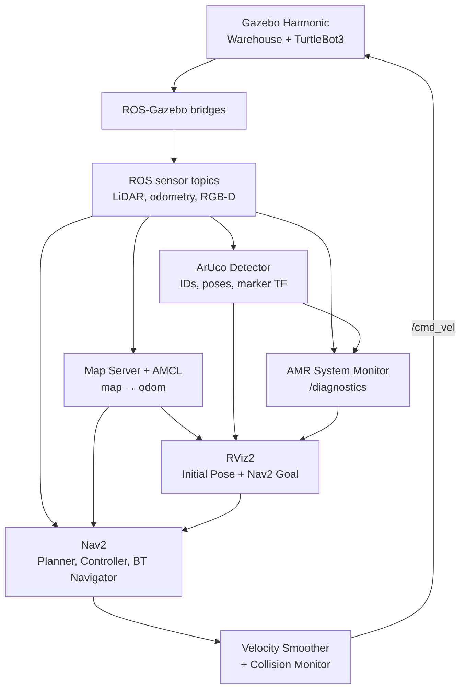

# AMR Navigation, Vision & Diagnostics

A simulation-based Autonomous Mobile Robot (AMR) project built with ROS 2 Jazzy, Gazebo Harmonic, Navigation2, OpenCV, and RViz2. It combines autonomous navigation, RGB-D perception, ArUco marker pose estimation, and live system health diagnostics in a custom warehouse environment.

> This repository targets simulation on Ubuntu 24.04. Physical robot deployment and visual odometry are not currently implemented.

## Features

- Custom Gazebo warehouse and TurtleBot3 Waffle RGB-D model
- Saved-map localization with AMCL and autonomous navigation with Nav2
- SLAM mode for mapping and exploration
- Simulated LiDAR, wheel odometry, IMU, RGB camera, and depth camera
- ArUco `DICT_4X4_50` detection, 3D pose estimation, debug images, and marker TF frames
- Health monitoring for LiDAR, odometry, velocity commands, RGB camera, and ArUco detection
- Three-stop waypoint mission: Pickup, Delivery, and Home
- ROS 2 simulation time and Gazebo-to-ROS sensor bridges

## Demo Video

The video below runs the interactive end-to-end validation script and verifies ROS 2 system discovery, AMCL localization and TF, Nav2 lifecycle states, sensor streams and frame IDs, navigation commands, ArUco marker ID and pose estimation, marker TF, and AMR health diagnostics.

[](https://youtu.be/RUlGBJWJuIA)

[Watch the AMR Navigation, ArUco Vision & Diagnostics demo on YouTube](https://youtu.be/RUlGBJWJuIA)

## Architecture



The main TF chain is:

```text
map
└── odom
    └── base_footprint
        └── base_link
            ├── base_scan
            ├── camera_rgb_optical_frame
            │   └── aruco_marker_<id>
            └── camera_depth_frame
```

## Repository Structure

```text
amr-navigation-vision-diagnostics/
├── docs/
│   ├── Nav2_Gazebo_Troubleshooting_TH.md
│   └── TEST_RESULTS.md
├── scripts/
│   └── demo_test.sh       # Interactive end-to-end validation
└── src/
    ├── amr_bringup/       # Launch files and Nav2 parameters
    ├── amr_diagnostics/   # Sensor and subsystem health monitor
    ├── amr_navigation/    # Nav2 waypoint mission
    ├── amr_simulation/    # Warehouse, map, and custom robot model
    └── amr_vision/        # ArUco detection and pose estimation
```

## Requirements

- Ubuntu 24.04 LTS
- ROS 2 Jazzy desktop installation
- Gazebo Harmonic
- Python 3
- A graphics environment capable of running Gazebo and RViz2

The commands below assume ROS 2 Jazzy is installed and `rosdep` has been initialized. Follow the [official ROS 2 Jazzy installation guide](https://docs.ros.org/en/jazzy/Installation.html) first if needed.

## Installation

Install the main runtime tools:

```bash
sudo apt update
sudo apt install -y \
  ros-jazzy-navigation2 \
  ros-jazzy-nav2-bringup \
  ros-jazzy-nav2-minimal-tb3-sim \
  ros-jazzy-slam-toolbox \
  ros-jazzy-ros-gz \
  ros-jazzy-ros-gz-image \
  ros-jazzy-cv-bridge \
  ros-jazzy-tf2-ros \
  python3-opencv \
  python3-numpy
```

Clone the repository and install package dependencies:

```bash
cd ~
git clone https://github.com/nattannsra18/amr-navigation-vision-diagnostics.git
cd amr-navigation-vision-diagnostics

source /opt/ros/jazzy/setup.bash
rosdep update
rosdep install --from-paths src --ignore-src -r -y
```

If `rosdep` has never been initialized on the machine, run `sudo rosdep init` once before `rosdep update`.

## Build

From the repository root:

```bash
source /opt/ros/jazzy/setup.bash
colcon build --symlink-install
source install/setup.bash
```

Source both setup files in every new terminal. Optionally add them to `~/.bashrc`:

```bash
echo 'source /opt/ros/jazzy/setup.bash' >> ~/.bashrc
echo 'source ~/amr-navigation-vision-diagnostics/install/setup.bash' >> ~/.bashrc
```

After changing source files, rebuild and source the workspace again:

```bash
cd ~/amr-navigation-vision-diagnostics
colcon build --symlink-install
source install/setup.bash
```

## Run

### Saved-map navigation, vision, and diagnostics

This is the main end-to-end launch:

```bash
cd ~/amr-navigation-vision-diagnostics
source /opt/ros/jazzy/setup.bash
source install/setup.bash
ros2 launch amr_bringup navigation.launch.py
```

In RViz2:

1. Click **2D Pose Estimate**, click the robot's approximate position on the map, drag in its forward direction, and release.
2. Wait for the particle cloud to converge and for localization to become active.
3. Click **Nav2 Goal**, select a free location, drag to set the desired heading, and release.

Run the predefined Pickup → Delivery → Home mission in another terminal:

```bash
source /opt/ros/jazzy/setup.bash
source ~/amr-navigation-vision-diagnostics/install/setup.bash
ros2 run amr_navigation waypoint_mission
```

### SLAM mode

Use this launch when creating or updating a map:

```bash
cd ~/amr-navigation-vision-diagnostics
source /opt/ros/jazzy/setup.bash
source install/setup.bash
ros2 launch amr_bringup simulation.launch.py
```

Drive the robot, then save a completed map with:

```bash
ros2 run nav2_map_server map_saver_cli -f warehouse_map
```

## ROS Nodes

Node availability depends on the selected launch mode. The main navigation launch starts or includes the following nodes.

| Node | Package / component | Responsibility |
|---|---|---|
| `/ros_gz_bridge` | `ros_gz_bridge` | Bridges Gazebo clock, LiDAR, odometry, commands, TF, and other simulation interfaces |
| `/camera_image_bridge` | `ros_gz_image` | Bridges RGB and depth images from Gazebo to ROS 2 |
| `/camera_info_bridge` | `ros_gz_bridge` | Bridges RGB camera calibration data |
| `/map_server` | Nav2 | Publishes the saved occupancy grid |
| `/amcl` | Nav2 | Localizes the robot and publishes the `map → odom` transform |
| `/planner_server` | Nav2 | Computes global paths |
| `/controller_server` | Nav2 | Computes local motion commands |
| `/bt_navigator` | Nav2 | Executes navigation behavior trees |
| `/behavior_server` | Nav2 | Provides recovery and auxiliary behaviors |
| `/smoother_server` | Nav2 | Smooths planned paths |
| `/waypoint_follower` | Nav2 | Executes multi-waypoint tasks |
| `/velocity_smoother` | Nav2 | Limits and smooths velocity commands |
| `/collision_monitor` | Nav2 | Applies an additional command-level safety layer |
| `/route_server` | Nav2 | Provides route-planning services when configured |
| `/aruco_detector` | `amr_vision` | Detects ArUco markers and publishes IDs, poses, TF, and a debug image |
| `/amr_system_monitor` | `amr_diagnostics` | Aggregates AMR health information on `/diagnostics` |

## ROS Topics and Actions

Rates are representative values observed in the current simulation configuration.

| Name | Type | Typical rate | Producer | Main consumers / purpose |
|---|---|---:|---|---|
| `/clock` | `rosgraph_msgs/msg/Clock` | ~1000 Hz | Gazebo bridge | Simulation time for all nodes |
| `/scan` | `sensor_msgs/msg/LaserScan` | 5 Hz | Gazebo bridge | AMCL, local costmap, collision monitor, diagnostics |
| `/odom` | `nav_msgs/msg/Odometry` | ~29 Hz | Gazebo bridge | Nav2, TF, and diagnostics |
| `/cmd_vel` | `geometry_msgs/msg/Twist` | ~20 Hz while active | Nav2 velocity pipeline | Robot motion command and diagnostics |
| `/camera/color/image_raw` | `sensor_msgs/msg/Image` | ~15 Hz | Image bridge | ArUco detector and camera health monitoring |
| `/camera/color/camera_info` | `sensor_msgs/msg/CameraInfo` | Sensor rate | Camera-info bridge | Camera intrinsics for pose estimation |
| `/camera/depth/image_raw` | `sensor_msgs/msg/Image` | 5 Hz | Image bridge | Depth visualization and future perception |
| `/map` | `nav_msgs/msg/OccupancyGrid` | Event / transient-local | Map server | AMCL, Nav2 costmaps, and RViz2 |
| `/amcl_pose` | `geometry_msgs/msg/PoseWithCovarianceStamped` | On localization updates | AMCL | Estimated robot pose in the `map` frame |
| `/aruco/marker_ids` | `std_msgs/msg/Int32MultiArray` | Camera rate | ArUco detector | IDs of visible markers |
| `/aruco/poses` | `geometry_msgs/msg/PoseArray` | Camera rate | ArUco detector | Marker poses in `camera_rgb_optical_frame` |
| `/aruco/debug_image` | `sensor_msgs/msg/Image` | Camera rate | ArUco detector | Annotated detection image |
| `/diagnostics` | `diagnostic_msgs/msg/DiagnosticArray` | 1 Hz | Nav2 and AMR monitor | System health reporting |
| `/tf`, `/tf_static` | `tf2_msgs/msg/TFMessage` | Dynamic / latched | Gazebo, robot state, AMCL, vision | Robot, sensor, map, and marker transforms |
| `/navigate_to_pose` | `nav2_msgs/action/NavigateToPose` | Action | BT Navigator | Single-goal autonomous navigation |
| `/follow_waypoints` | `nav2_msgs/action/FollowWaypoints` | Action | Waypoint follower | Multi-goal mission execution |

Important sensor frames:

| Data | Frame ID |
|---|---|
| LiDAR | `base_scan` |
| RGB image and ArUco poses | `camera_rgb_optical_frame` |
| Depth image | `camera_depth_frame` |
| AMCL pose | `map` |

## Diagnostics

The AMR monitor publishes these statuses in `diagnostic_msgs/msg/DiagnosticArray`:

| Status name | Healthy message | Checks |
|---|---|---|
| `AMR/LiDAR` | `LaserScan healthy` | Scan freshness, valid ranges, and minimum obstacle distance |
| `AMR/Odometry` | `Odometry healthy` | Odometry freshness and measured linear/angular velocity |
| `AMR/VelocityCommand` | `Velocity command active` or `No recent velocity command` | Command freshness and requested velocities |
| `AMR/Camera` | `RGB camera healthy` | Image freshness, resolution, encoding, and frame ID |
| `AMR/ArUco` | `ArUco marker detected` | Marker IDs, pose freshness, distance, and camera frame |

Inspect only AMR health entries:

```bash
ros2 topic echo /diagnostics --once \
  --filter "any(s.name.startswith('AMR/') for s in m.status)"
```

ROS diagnostic levels are `0 = OK`, `1 = WARN`, `2 = ERROR`, and `3 = STALE`. The CLI may render level `0` as `"\0"`.

## Verification

Run the complete interactive end-to-end test after starting `navigation.launch.py`:

```bash
cd ~/amr-navigation-vision-diagnostics
chmod +x scripts/demo_test.sh
./scripts/demo_test.sh
```

The script guides the operator through setting the initial pose, sending a navigation goal, presenting ArUco marker ID 0 to the camera, and validating diagnostics. A successful run ends with `ALL AMR DEMO TESTS PASSED`.

The checks below can also be run individually.

Check the core sensor streams:

```bash
timeout 5 ros2 topic hz /scan
timeout 5 ros2 topic hz /odom
timeout 5 ros2 topic hz /camera/color/image_raw
timeout 5 ros2 topic hz /camera/depth/image_raw
```

Check localization and TF connectivity:

```bash
ros2 topic echo /amcl_pose --once
timeout 5 ros2 run tf2_ros tf2_echo map base_footprint
timeout 5 ros2 run tf2_ros tf2_echo map camera_rgb_optical_frame
```

Check ArUco perception while marker ID 0 is visible to the RGB camera:

```bash
ros2 topic echo /aruco/marker_ids --once
ros2 topic echo /aruco/poses --once
timeout 5 ros2 run tf2_ros tf2_echo map aruco_marker_0
```

Check Nav2 lifecycle states:

```bash
for node in \
  amcl map_server planner_server controller_server bt_navigator \
  behavior_server smoother_server waypoint_follower velocity_smoother \
  collision_monitor route_server
do
  printf "%-25s " "/$node"
  ros2 lifecycle get "/$node"
done
```

Each managed node should report `active [3]` before navigation.

## Test Results

The complete system was tested in the warehouse simulation on Ubuntu 24.04 with ROS 2 Jazzy and Gazebo Harmonic. The values below are representative measurements from the successful end-to-end run on 2026-08-29; rates may vary slightly between machines.

### Sensor and control streams

| Test | Measured result | Frame | Status |
|---|---:|---|---|
| Simulation clock | ~1000 Hz | — | PASS |
| LiDAR `/scan` | 5.000 Hz | `base_scan` | PASS |
| Wheel odometry `/odom` | ~29.4 Hz | Odometry frames | PASS |
| RGB image `/camera/color/image_raw` | ~15.2 Hz, 640×480, `rgb8` | `camera_rgb_optical_frame` | PASS |
| Depth image `/camera/depth/image_raw` | 5.001 Hz | `camera_depth_frame` | PASS |
| Navigation command `/cmd_vel` | ~20 Hz while navigating | — | PASS |

### Navigation and localization

| Test | Observed result | Status |
|---|---|---|
| Nav2 lifecycle | All 11 managed nodes reported `active [3]` | PASS |
| Initial pose | RViz **2D Pose Estimate** produced `/amcl_pose` in `map` | PASS |
| Localization TF | `map → odom → base_footprint` was available | PASS |
| Camera TF | `map → camera_rgb_optical_frame` was available | PASS |
| Autonomous goal | Nav2 published `/cmd_vel` and the robot moved toward the RViz goal | PASS |
| Dynamic pose update | `map → base_footprint` changed while the robot was moving | PASS |

The active lifecycle nodes were `/amcl`, `/map_server`, `/planner_server`, `/controller_server`, `/bt_navigator`, `/behavior_server`, `/smoother_server`, `/waypoint_follower`, `/velocity_smoother`, `/collision_monitor`, and `/route_server`.

### ArUco vision

Marker ID `0` was successfully detected in the RGB image.

| Output | Measured result | Status |
|---|---|---|
| `/aruco/marker_ids` | `[0]` | PASS |
| Camera-frame marker position | `x=-0.578 m`, `y=-0.210 m`, `z=3.960 m` | PASS |
| Estimated marker distance | `4.008 m` | PASS |
| Marker pose frame | `camera_rgb_optical_frame` | PASS |
| Map-frame marker TF | `map → aruco_marker_0` available at approximately `(8.311, 0.074, 0.330) m` | PASS |
| Debug image | Marker boundary, axes, and ID annotation visible | PASS |

### Diagnostics

All custom AMR diagnostics reported level `0` (`OK`) during the healthy test condition.

| Diagnostic | Observed message / value | Status |
|---|---|---|
| `AMR/LiDAR` | `LaserScan healthy`; minimum range `0.551 m`; age `0.20 s` | PASS |
| `AMR/Odometry` | `Odometry healthy`; data age `0.01 s` | PASS |
| `AMR/VelocityCommand` | `No recent velocity command` while the robot was idle | PASS |
| `AMR/Camera` | `RGB camera healthy`; 640×480 `rgb8`; age `0.06 s` | PASS |
| `AMR/ArUco` | `ArUco marker detected`; ID `[0]`; distance `4.008 m`; age `0.06 s` | PASS |

See [Complete Test Results](docs/TEST_RESULTS.md) for the commands, acceptance criteria, measured values, and notes from every test.

## Troubleshooting

See [Nav2 and Gazebo Troubleshooting (Thai)](docs/Nav2_Gazebo_Troubleshooting_TH.md) for lifecycle, TF, simulation-time, and velocity-pipeline debugging notes.

Common checks:

- If RViz shows **Localization: inactive** or **Navigation: inactive**, confirm that every Nav2 lifecycle node is `active [3]` and click the RViz **Startup** button if available.
- If **2D Pose Estimate** appears to do nothing, verify that `/scan` is publishing and that `map → odom → base_footprint → base_scan` is connected.
- If a topic exists but prints no messages, compare publisher and subscriber QoS profiles with `ros2 topic info <topic> -v`.
- A one-time `Invalid frame ID` message from `tf2_echo` can occur while the TF listener is discovering frames; continuing transform output confirms the chain is available.

## Roadmap

- [x] Custom warehouse simulation and robot model
- [x] SLAM and saved-map navigation
- [x] AMCL localization and Nav2 goal execution
- [x] RGB-D camera bridges
- [x] ArUco detection, pose estimation, and marker TF
- [x] Multi-sensor diagnostics
- [x] Multi-waypoint mission
- [ ] Automated launch and integration tests
- [ ] Rosbag-based experiment datasets and performance reports
- [ ] Visual odometry and wheel/visual odometry comparison
- [ ] Physical robot deployment

## Documentation

Additional project documentation:

- [Complete Test Results](docs/TEST_RESULTS.md)
- [Nav2 and Gazebo Troubleshooting (Thai)](docs/Nav2_Gazebo_Troubleshooting_TH.md)
